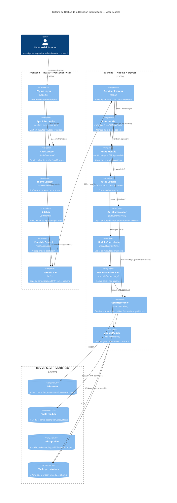
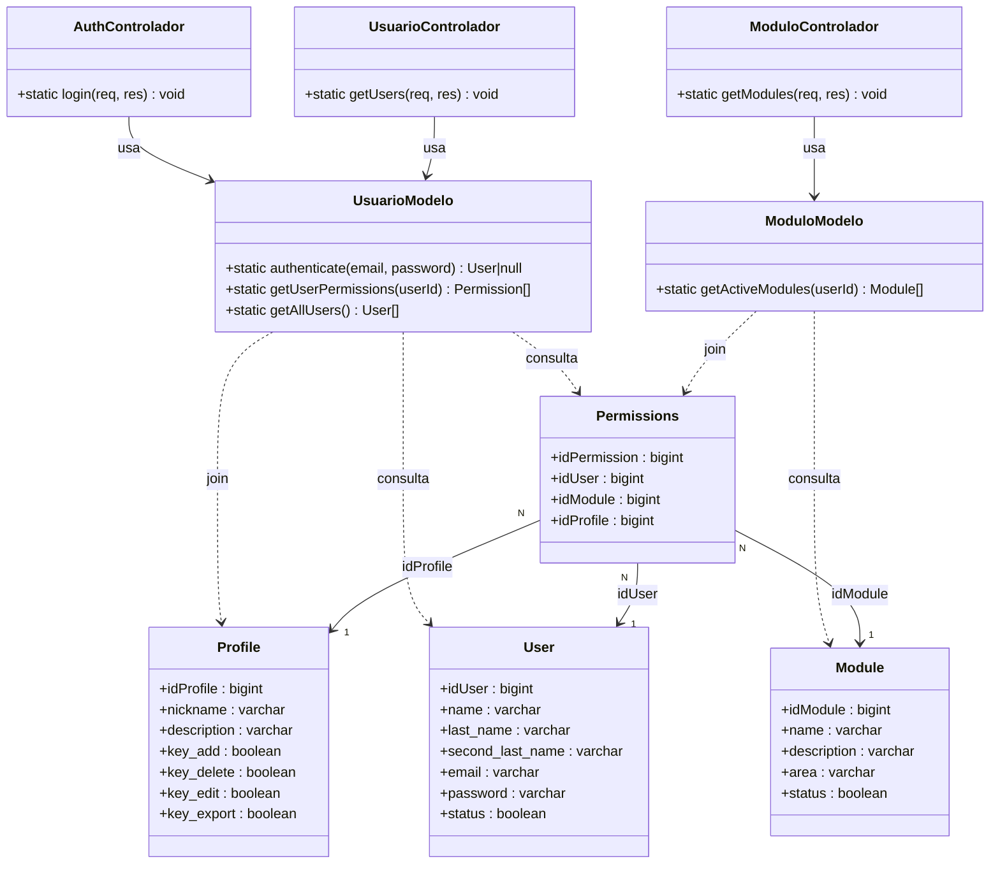
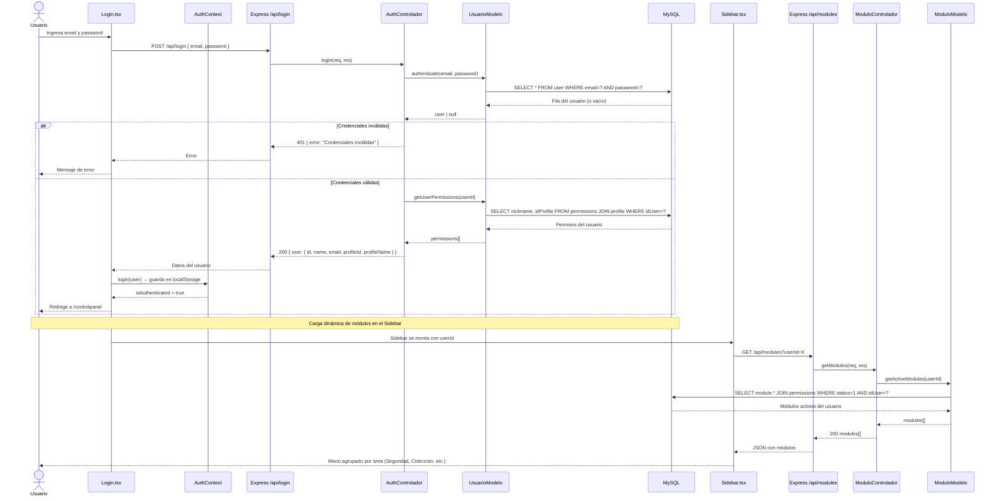

# Arquitectura del Sistema — Colección Entomológica (UG)

## 1. Diagrama de Componentes (C4 / UML)

---

## 2. Diagrama de Clases — Capa de Datos (UML)

---

## 3. Diagrama de Flujo — Autenticación y Carga de Módulos

---

## 4. Justificación de Arquitectura

### 4.1 Patrón General: Cliente-Servidor con Separación de Capas

El sistema adopta una **arquitectura cliente-servidor de dos nodos físicos distintos**: un frontend SPA (Single Page Application) y un backend API REST. Ambos se comunican exclusivamente mediante HTTP/JSON, lo que permite que cada capa evolucione de forma independiente.

Dentro del backend, se aplica el patrón **MVC simplificado**:

| Capa | Responsabilidad | Archivos |
|---|---|---|
| **Rutas (Router)** | Mapeo de endpoints HTTP a controladores | `rutasAuth.js`, `rutasModulo.js`, `rutasUsuario.js` |
| **Controladores** | Orquestación de la lógica de negocio, manejo de req/res | `authControlador.js`, `moduloControlador.js`, `usuarioControlador.js` |
| **Modelos** | Acceso directo a la base de datos, encapsulamiento de queries SQL | `usuarioModelo.js`, `moduloModelo.js` |
| **Base de Datos** | Persistencia relacional | MySQL — esquema `UG` |

Esta separación permite que los **controladores no conozcan SQL** y que los **modelos no conozcan el protocolo HTTP**, lo que incrementa la cohesión y facilita futuras pruebas unitarias.

---

### 4.2 Frontend: React + TypeScript con Vite

Se eligió **React con TypeScript** por las siguientes razones:

- **Tipado estático**: TypeScript previene errores en tiempo de compilación, especialmente relevante en interfaces complejas como los permisos por usuario/módulo/perfil.
- **Componentización**: La UI se divide en piezas reutilizables (`Sidebar`, `Login`, `Controlpanel`, `AccessDeniedModal`, `ErrorBoundary`), facilitando el mantenimiento y escalabilidad.
- **Vite** como bundler garantiza tiempos de compilación y HMR (Hot Module Replacement) extremadamente rápidos durante el desarrollo.
- **React Router DOM** maneja las rutas del lado del cliente con `ProtectedRoute`, asegurando que solo usuarios autenticados accedan a `/controlpanel`.

---

### 4.3 Gestión de Estado Global con Context API

Se utilizan dos contextos React:

- **`AuthContext`**: Mantiene el estado de sesión del usuario (id, nombre, email, profileId, profileName). Persiste en `localStorage` para sobrevivir recargas de página sin necesidad de re-autenticación.
- **`ThemeContext`**: Gestiona la preferencia de tema (oscuro/claro) del usuario de forma global, desacoplando lógica de presentación de los componentes individuales.

Este enfoque se justifica por la **escala actual del sistema**: la Context API es suficiente para la cantidad de datos compartidos sin introducir la complejidad de Redux u otras librerías de estado pesadas.

---

### 4.4 Backend: Node.js + Express

- **Node.js** permite usar JavaScript tanto en frontend como en backend, reduciendo la curva de aprendizaje del equipo y permitiendo reutilizar lógica de validación en el futuro.
- **Express** es minimalista y altamente extensible. El sistema se estructura con rutas modulares montadas en el servidor principal (`index.js`), lo que facilita agregar nuevos dominios (módulos de la colección como Ejemplares, Préstamos, Datos Ecológicos, etc.) sin modificar código existente.
- **CORS habilitado globalmente** permite que el frontend y el backend puedan correr en puertos distintos durante el desarrollo (Vite proxying incluido).
- **Variables de entorno** (`.env` + `dotenv`) para credenciales de base de datos y puerto, siguiendo buenas prácticas de seguridad y portabilidad.

---

### 4.5 Base de Datos: MySQL con Modelo Relacional

El esquema fue diseñado para soportar un **sistema de control de acceso basado en roles por módulo (RBAC granular)**:

- La tabla `permissions` es la **entidad central** que vincula Usuario ↔ Módulo ↔ Perfil, con restricción `UNIQUE (idUser, idModule)`, garantizando que un usuario tenga exactamente un perfil por módulo.
- La tabla `profile` define **permisos funcionales** (agregar, eliminar, editar, exportar), permitiendo granularidad sin necesidad de lógica adicional en el backend.
- Los módulos agrupados por `area` (Seguridad, Administrativo, Colección, Investigación, Sistema) reflejan directamente la **estructura organizacional del dominio entomológico**, simplificando la navegación en el sidebar.

---

### 4.6 Seguridad y Consideraciones Futuras

| Aspecto | Estado actual | Recomendación futura |
|---|---|---|
| Autenticación | Credenciales en texto plano (DB) | Implementar hashing con bcrypt |
| Sesiones | `localStorage` sin expiración | JWT con refresh tokens |
| Autorización en rutas backend | Sin middleware de guards | Middleware de verificación de perfil por endpoint |
| HTTPS | No implementado localmente | Obligatorio en producción |

La arquitectura actual es **adecuada para la etapa de desarrollo y prototipado** del sistema, y fue diseñada de forma que cada una de estas mejoras puede incorporarse de manera incremental sin reescribir la base existente.
