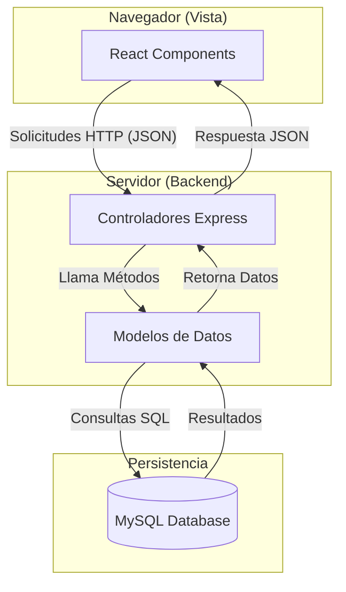

# Reporte Técnico del Sistema - Sistema Privado

## 1. Documento de Arquitectura Aplicada

El sistema se basa en una arquitectura de **Cliente-Servidor** desacoplada, utilizando tecnologías modernas para garantizar la escalabilidad y mantenibilidad.

- **Frontend (Cliente):** Desarrollado con **React** y **Vite**, utilizando **TypeScript** para un tipado fuerte y **Context API** para el manejo de estados globales (Autenticación y Temas).
- **Backend (Servidor):** Una API RESTful construida con **Node.js** y **Express**.
- **Base de Datos:** Motor relacional **MySQL** para la persistencia de datos.
- **Comunicación:** Protocolo HTTP mediante JSON para el intercambio de datos entre cliente y servidor.

---

## 2. Diagrama MVC

El sistema sigue el patrón de diseño **Modelo-Vista-Controlador (MVC)** para organizar la lógica de negocio y la interfaz de usuario:



---

## 3. Explicación del Flujo del Sistema

1. **Autenticación:** El usuario ingresa credenciales en la vista de Login.
2. **Validación:** El servidor recibe las credenciales y el **Modelo** consulta la base de datos de forma segura.
3. **Respuesta de Sesión:** Si son válidas, el servidor retorna la información del usuario y sus permisos de perfil.
4. **Estado Global:** El `AuthContext` en el frontend captura esta información, marcando al usuario como autenticado.
5. **Navegación:** El componente `ProtectedRoute` permite o deniega el acceso a las rutas del panel de control basándose en el estado de autenticación.
6. **Consumo de Módulos:** El usuario interactúa con los módulos, los cuales solicitan datos al controlador correspondiente del backend.

---

## 4. Medidas de Seguridad Implementadas

- **Protección contra Inyección SQL:** Todas las consultas a la base de datos utilizan sentencias preparadas y parámetros (vía `mysql2`), evitando que código malicioso sea ejecutado en las queries.
- **Control de Acceso (RBAC):** El sistema identifica el `idProfile` del usuario al loguearse, permitiendo una futura escalabilidad para permisos detallados por módulo.
- **Validación de Rutas en Frontend:** Implementación de un Higher Order Component (HOC) llamado `ProtectedRoute` que previene el acceso a vistas administrativas sin una sesión activa.
- **CORS (Cross-Origin Resource Sharing):** Configuración de middleware en Express para restringir qué dominios pueden interactuar con la API.
- **Sanitización de Datos:** Express procesa automáticamente el cuerpo de las peticiones como JSON, proporcionando un nivel básico de validación de estructura.

---

## 5. Identificación de Riesgos Mitigados

| Riesgo | Descripción | Medida de Mitigación |
| :--- | :--- | :--- |
| **Inyección SQL** | Intento de manipular la base de datos vía inputs. | Uso de consultas parametrizadas. |
| **Acceso no autorizado** | Usuarios intentando entrar a rutas sin loguearse. | Middleware `ProtectedRoute` y redirección forzada. |
| **Fuga de Información** | Exposición de datos sensibles en errores. | Bloques `try-catch` con logs controlados en el servidor. |
| **Peticiones malintencionadas** | Peticiones desde sitios no autorizados. | Implementación de CORS. |

---

## 6. Evidencias de Seguridad y Funcionamiento

### A. Código Fuente (Fragmentos Clave)

**Validación Segura (Modelo):**
```javascript
// server/modelos/usuarioModelo.js
static async authenticate(email, password) {
    const [users] = await db.query(
        'SELECT * FROM user WHERE email = ? AND password = ?',
        [email, password]
    );
    return users.length > 0 ? users[0] : null;
}
```

**Protección de Módulos (Frontend):**
```tsx
// src/App.tsx
const ProtectedRoute: React.FC<{ children: React.ReactNode }> = ({ children }) => {
  const { isAuthenticated } = useAuth();
  if (!isAuthenticated) return <Navigate to="/login" replace />;
  return <>{children}</>;
};
```

**Validaciones en Frontend (UI/UX):**
```tsx
// src/vistas/Login.tsx
<input
  type="email"
  required
  className="form-input"
  maxLength={150}
/>
```
*El sistema implementa límites de caracteres (`maxLength`), campos requeridos y retroalimentación visual al usuario ante errores de autenticación.*

### B. Capturas de Funcionamiento
*(Espacio reservado para capturas de pantalla)*

#### Evidencia de Login / Control de Acceso
> [!NOTE]
> *Insertar captura de pantalla del formulario de login y la respuesta exitosa/fallida.*

#### Evidencia de Protección de Módulos
> [!NOTE]
> *Insertar captura intentando acceder a /controlpanel sin estar logueado (redirección).*

#### Evidencia de Validaciones
> [!NOTE]
> *Insertar captura de mensajes de error de validación en el front o back.*

---

## 7. Conclusión
El sistema implementa las bases robustas de una aplicación web segura, siguiendo los estándares de la industria en cuanto a separación de responsabilidades y protección de datos.
